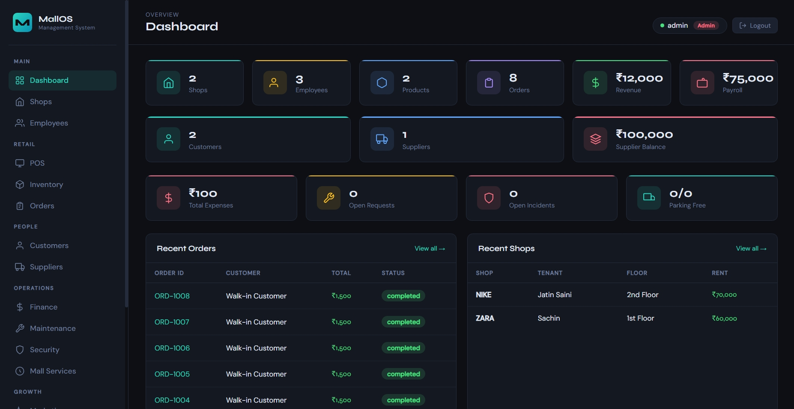
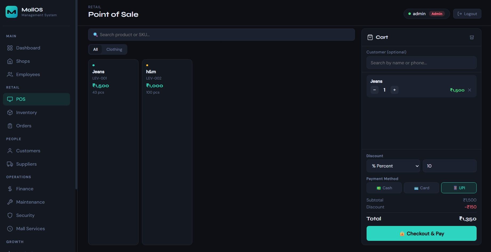
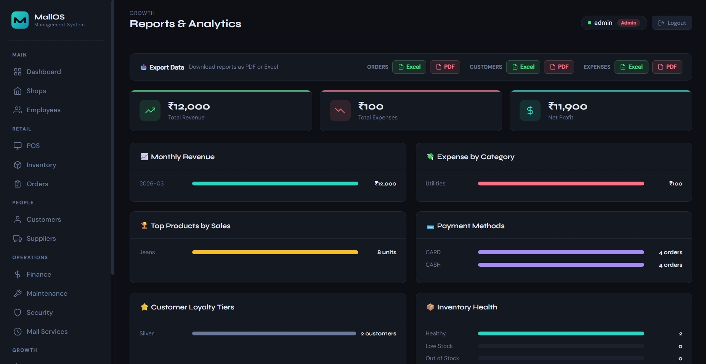
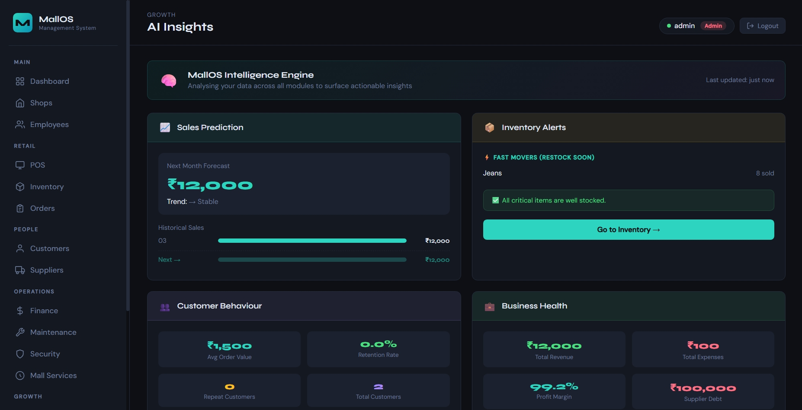

# 🏬 MallOS — Mall Management System

<div align="center">


**A full-stack system to manage modern shopping malls — from daily operations to AI-driven insights — all in one unified dashboard.**

[🌐 Live Demo](#-live-demo) · [📸 Screenshots](#-screenshots) · [⚙️ Installation](#-installation) · [✨ Features](#-features)

</div>

---

## 📌 About The Project

Managing a mall is complex — data is scattered across Excel sheets, notebooks, and disconnected tools.

MallOS solves this by bringing everything into a **single, centralized platform**.

It allows mall administrators to:

* Track shop rents and tenants
* Manage employees and suppliers
* Run a full billing system (POS)
* Control inventory in real-time
* Monitor finances and expenses
* Analyze performance using AI insights

👉 Built not just as a project, but as a **real-world scalable solution**.

---

## ✨ Features

### 🏪 Core Management

* Shops with rent, category, and floor tracking
* Employee directory with role and salary management
* Inventory system with SKU, pricing, and stock alerts

### 💳 Point of Sale (POS)

* Fast billing interface with live search
* Discount support (percentage / flat)
* Payment modes: Cash, Card, UPI
* Auto stock deduction
* Loyalty points system

### 📦 Orders & Returns

* Full order lifecycle tracking
* Return handling with stock restoration
* Detailed order receipts

### 👥 Customers & Suppliers

* Customer loyalty tiers and tracking
* Points and visit analytics
* Supplier management with balance tracking

### 💰 Finance

* Expense tracking by category
* Profit/Loss calculation
* Monthly financial insights

### 🔧 Operations

* Maintenance request system
* Security incident logging
* Mall services (parking, events, food court, cinema)

### 📣 Marketing & Feedback

* Campaign creation (Email / SMS / Social)
* Coupon and discount management
* Customer feedback system

### 📊 Reports & AI Insights

* Sales trends and analytics
* Top products and revenue breakdown
* Customer behavior insights
* Export reports to Excel & PDF

### 🔐 Authentication

* Role-based access (Admin / Manager / Cashier)
* Session timeout for security
* Secure password hashing

---

## 🛠️ Tech Stack

| Layer      | Technology               |
| ---------- | ------------------------ |
| Backend    | Python, Flask            |
| Database   | MongoDB Atlas + SQLite   |
| Frontend   | HTML, CSS, JavaScript    |
| Auth       | Flask Sessions, Werkzeug |
| Reports    | ReportLab, Pandas        |
| Deployment | Render                   |

---

## 📁 Project Structure

```
Mall_Management/
│
├── README.md
├── screenshots/
│
├── mall_mgmt/
│   ├── app.py
│   ├── auth.py
│   ├── database.py
│   ├── templates/
│   └── static/
```

---

## ⚙️ Installation

### Prerequisites

* Python 3.10+
* MongoDB Atlas or local MongoDB
* Git

### Clone repo

```bash
git clone https://github.com/YOUR_USERNAME/Mall_Management.git
cd Mall_Management
```

### Setup environment

```bash
python -m venv venv
venv\Scripts\activate
pip install -r mall_mgmt/requirements.txt
```

### Configure `.env`

```env
MONGO_URI=your_mongodb_uri
DB_NAME=mall_management
SECRET_KEY=your_secret_key
```

### Run

```bash
python mall_mgmt/app.py
```

Open: http://localhost:5000

---

## 🌐 Live Demo

Run locally or use ngrok:

```bash
ngrok http 5000
```

---

## 📸 Screenshots






---

## 🚀 Future Improvements

* Barcode scanner integration
* Multi-mall support
* SMS/Email alerts
* Advanced analytics dashboard
* Mobile application

---

## 📄 License

MIT License

---

## 👨‍💻 Author

**Jatin Saini**

---

<div align="center">
Built with ❤️ using Flask & MongoDB
</div>